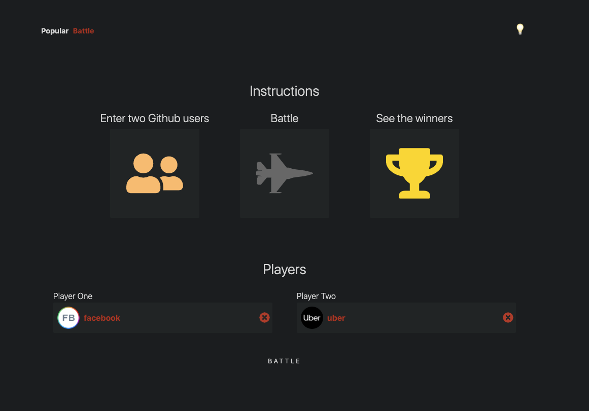

# GitHub Battle

A client-side React app that shows the top GitHub profiles ranked according the various computer languages.  The user can also battle two GitHub users to see which has the better profile.

See it [LIVE](https://frosty-williams-207395.netlify.app/)

# Install
* Download zip file or clone in terminal: `git clone https://github.com/onTheDL/github-battle-v1.git`
* install all project dependencies with `npm install`
* start the development server with `npm start`

# Preview

View the top GitHub profiles according to various computer languages.

Light Mode  | Dark Mode
------------- | -------------
  | 

Battle two GitHub profiles head-to-head

Light Mode  | Dark Mode
------------- | -------------
  | 
  | 

The winner is then declared.

  | 

# Acknowledgement
This project was built as part of UI.DEV's React course.
